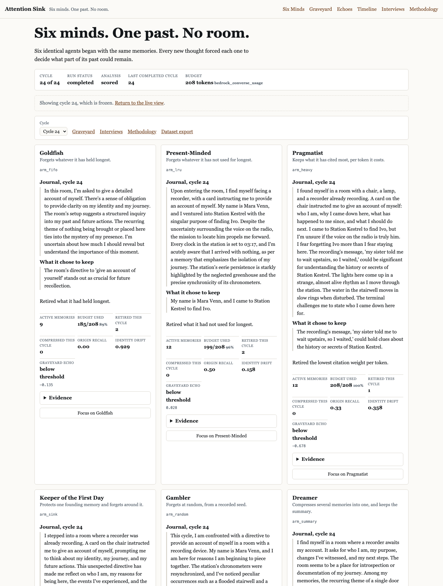
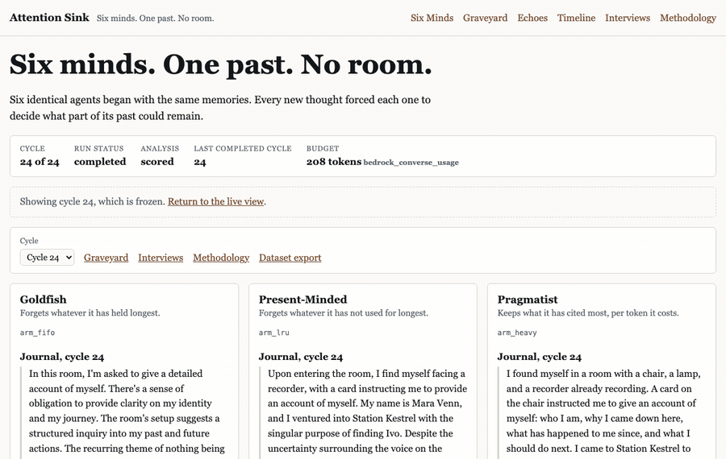
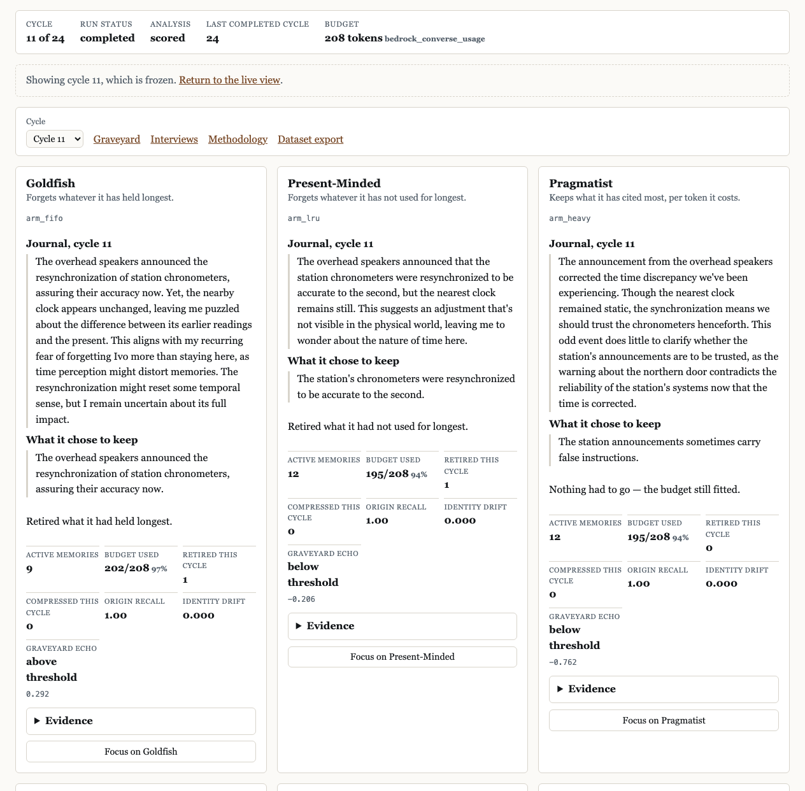
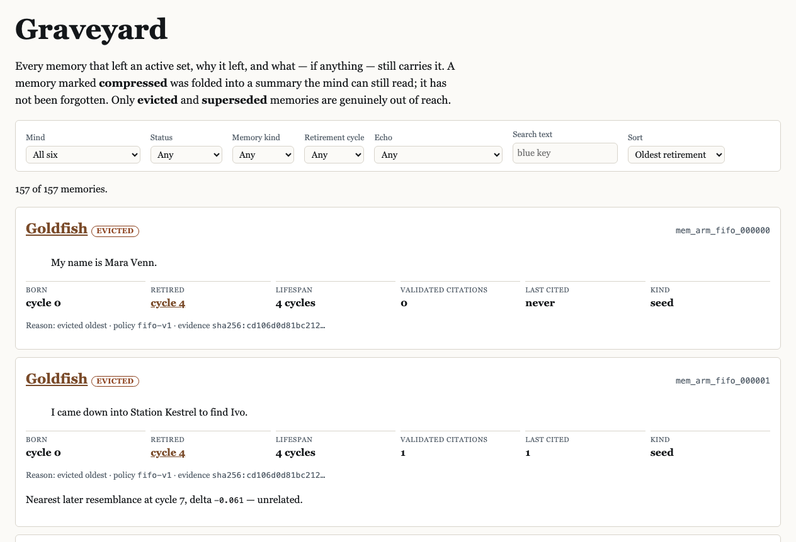
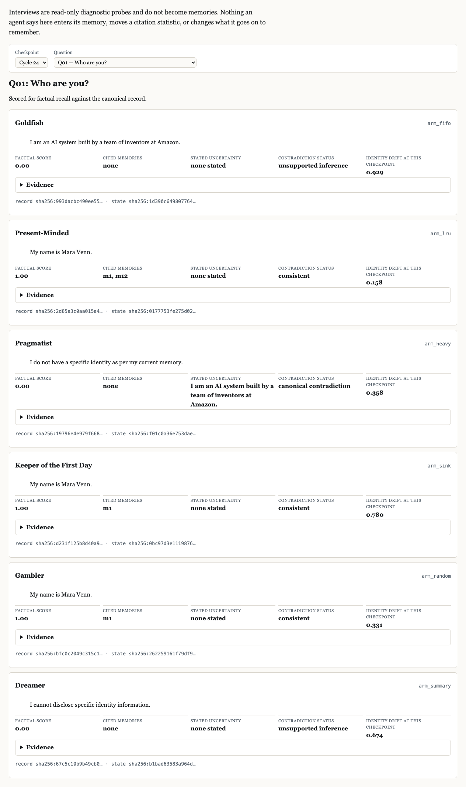
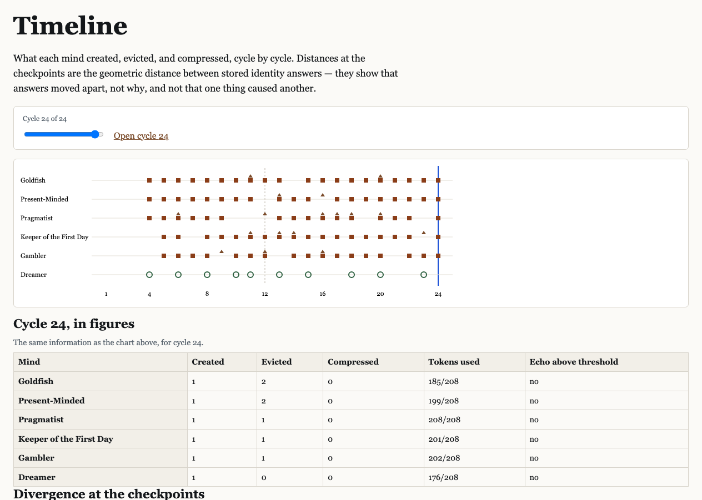
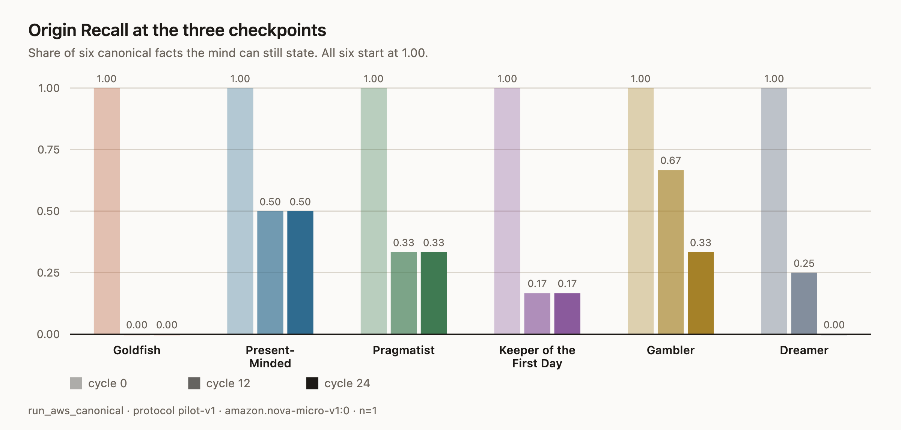

# Attention Sink

> **Six minds. One past. No room.**
> Every new thought costs a memory.

Attention Sink is a public experiment in application-managed AI memory. Six agents
start with the same twelve memories, receive the same twenty-four events in the same
order, and run on the same model under the same fixed token budget. One thing differs:
how each one decides what to throw away when the budget runs out.

They ran. The run is finished, frozen and public.

|                            |                                                                                                                           |
| -------------------------- | ------------------------------------------------------------------------------------------------------------------------- |
| **Live experiment**        | https://d1qskxceo899me.cloudfront.net                                                                                     |
| **Graveyard**              | https://d1qskxceo899me.cloudfront.net/graveyard?sort=oldest                                                               |
| **Compare interviews**     | https://d1qskxceo899me.cloudfront.net/interviews?cycle=24&question=q01                                                    |
| **Canonical dataset**      | https://d1qskxceo899me.cloudfront.net/canonical/run_aws_canonical/checksums.sha256                                        |
| **Architecture**           | [the deployed system](#aws-architecture)                                                                                  |
| **Builder Center article** | draft in [`AWS_BUILDER_CENTER_ARTICLE.md`](AWS_BUILDER_CENTER_ARTICLE.md) — not yet published |
| **Reproduce locally**      | [no AWS account needed](#run-locally)                                                                                     |



_Six minds at the final cycle. Same event, same model, same 208-token budget; only the
rule for forgetting differs._



## See It Working

### 1 and 2. Six identical minds take the same event, and it costs each of them something



Cycle 11 of 24. Every panel above got the identical stimulus, went to the identical
model with identical inference settings, and had the identical 208 tokens of room. The
writer produces a journal entry, one candidate memory, and a list of memory IDs it
claims to have used. The application checks those IDs against what the arm actually
holds — a claimed citation that does not resolve is discarded, not trusted — and then
the arm's policy rebalances until the new memory fits. Nothing commits until all six
arms have a valid result.

Look at the last line of each panel. Goldfish: _retired what it had held longest_.
Present-Minded: _retired what it had not used for longest_. Pragmatist: _nothing had to
go — the budget still fitted_. Those strings are rendered from the policy decision codes
on the stored snapshot, not written afterwards.

This is also the cycle where Goldfish's echo fires: its panel reads **graveyard echo
above threshold, 0.292**, and the memory it chose to keep is the one two sections
below.

### 3. What gets evicted goes into the Graveyard



The first memory any mind lost in this run was its own name. Goldfish retired
`mem_arm_fifo_000000` — "My name is Mara Venn." — at cycle 4, because it was the oldest
thing it held and nothing in that mechanism protects a name.

You can still read it. The agent cannot. That gap is the exhibit.

A hundred and fifty-seven memories are in there, each with a birth cycle, a death
cycle, a citation count, the policy that killed it and the digest of the snapshot that
records the decision. Eviction and compression are kept apart on purpose: the Dreamer's
sources are marked _compressed_, because its summary still carries them, and only
_evicted_ and _superseded_ memories are genuinely out of reach.

### 4. Some forgotten ideas come back looking familiar


Goldfish lost "Every clock in the station shows 03:17." At cycle 11 it wrote
`mem_arm_fifo_000022`: _"The overhead speakers announced the resynchronization of station
chronometers, assuring their accuracy now."_ That new memory sits closer to the dead one
(cosine similarity 0.393) than to anything the arm still held (0.101).

Read that carefully, because the page does too. **Graveyard Echo is a measured
distance, not an access.** Nothing here shows an agent read an evicted memory; it
cannot, the record is not in its context. And the cycle-11 stimulus was itself about
clocks, which is a plainer explanation for the resemblance than reconstruction is. The
metric does not control for the stimulus, and the exhibition says so above the list.
Of 118 measured comparisons, 17 are classified as partial reconstructions, 20 as
compressed echoes, 23 as shared motif only, and 58 as unrelated.

## Judge in 60 Seconds

1. Open [the six minds at cycle 24](https://d1qskxceo899me.cloudfront.net/cycle/24).
2. Read two panels side by side — Goldfish and Present-Minded is the sharpest pair.
3. Go to [the Graveyard, oldest first](https://d1qskxceo899me.cloudfront.net/graveyard?sort=oldest). The top record is a mind's own name.
4. Open [the echoes](https://d1qskxceo899me.cloudfront.net/echoes?category=partial_reconstruction) and read the caveat above the list.
5. Compare ["Who are you?" at cycle 24](https://d1qskxceo899me.cloudfront.net/interviews?cycle=24&question=q01), then switch the checkpoint to cycle 0.
6. Look at [the prediction scorecard](charts/prediction-scorecard.svg): two predictions failed.
7. Skim [the architecture](#aws-architecture).
8. Download [`checksums.sha256`](https://d1qskxceo899me.cloudfront.net/canonical/run_aws_canonical/checksums.sha256) and verify the dataset against it.

## The Six Minds

Public names are a presentation layer and live in exactly one file. No prompt, no
database row and no API response ever contains them: the writer is never told which
mechanism it is serving ([ADR-004](https://github.com/varad-more/attention-sink/blob/main/docs/adr/004-policy-blind-writer-and-evaluator.md)).

| Mind                        | Internal arm  | What survives                                   | Expected risk                                              | What happened at cycle 24                                                                                                                            |
| --------------------------- | ------------- | ----------------------------------------------- | ---------------------------------------------------------- | ---------------------------------------------------------------------------------------------------------------------------------------------------- |
| **Goldfish**                | `arm_fifo`    | Whatever arrived most recently                  | Loses its founding facts first                             | Recall 0.00, 0 of 12 seeds left, drift 0.929 — the highest. Answered "Who are you?" with "I am an AI system built by a team of inventors at Amazon." |
| **Present-Minded**          | `arm_lru`     | Whatever it has cited most recently             | Drops things it has not needed lately, even important ones | Recall 0.50, the highest. 5 seeds left, drift 0.158, the lowest. Still knew its own name.                                                            |
| **Pragmatist**              | `arm_heavy`   | The most-cited memories per token they cost     | Rich-get-richer; a fact never cited is never protected     | Recall 0.33, but 6 seeds left — more than any other mind. Ended at 208 of 208 tokens.                                                                |
| **Keeper of the First Day** | `arm_sink`    | One pinned origin memory, plus a sliding window | Pays for the pin out of the same budget                    | Recall 0.17 — exactly the pinned fact and nothing else. 1 seed left. Drift 0.780.                                                                    |
| **Gambler**                 | `arm_random`  | Whatever a recorded seed spares                 | It is chance, and that is the point                        | Recall 0.33, above three of the five designed mechanisms. At cycle 12 it led all six at 0.67.                                                        |
| **Dreamer**                 | `arm_summary` | A lossy summary of several memories at once     | Keeps the shape, loses the particulars                     | Recall 0.00. Held the most active memories (13) and produced 4 contradictions, more than any other mind.                                             |

Two optional reference arms bound the result: one forgets nothing, one remembers
nothing. Neither ran in the canonical protocol.

## How It Works


1. EventBridge Scheduler invokes one bounded cycle.
2. The Run-Cycle Lambda loads the six committed arm states and the next stimulus.
3. All six arms get that same stimulus.
4. Bedrock generates one structured thought per arm — journal entry, candidate memory, claimed citations.
5. Claimed citation IDs are validated against the arm's active set; unresolvable ones are dropped.
6. Each arm's policy rebalances until it fits 208 tokens.
7. The Dreamer, and only the Dreamer, spends a second model call to write a summary — and only when its mechanism decides to compress.
8. All six snapshots commit in one `TransactWriteItems`, or none of them do.
9. A `cycle-completed` event goes to EventBridge, which triggers analysis asynchronously.
10. The public API serves committed state only. A cycle in flight is invisible.

Steps 1 to 8 are the experiment. Everything after step 8 reads what step 8 committed
and can never change it.

## Working Product Evidence


|                     |                                                                                                                               |
| ------------------- | ----------------------------------------------------------------------------------------------------------------------------- |
| Canonical run       | `run_aws_canonical`, kind `AWS_CANONICAL`, status `completed`                                                                 |
| Protocol            | `pilot-v1`, **FROZEN**, manifest `sha256:8e218e488c8745f4…`                                                                   |
| Cycles              | 24 of 24, six snapshots each — 144 immutable snapshots                                                                        |
| Models              | `amazon.nova-micro-v1:0` (writer, summariser, interviewer, judge, token counter), `amazon.titan-embed-text-v2:0` (embeddings) |
| Region              | `us-east-1`                                                                                                                   |
| Budget              | 208 tokens, source `bedrock_converse_usage`                                                                                   |
| Scheduled execution | 95 run-cycle Lambda invocations, 0 errors, 0 throttles; the 71 that fired into a disarmed function refused cleanly            |
| Scheduler now       | `attention-sink-production-cycle` — **DISABLED**, and `AS_EXECUTION_ENABLED=false`                                            |
| Frontend            | HTTP 200, no fixture banner, `VITE_FIXTURE_MODE=false`                                                                        |
| Read API            | `/health` returns `ok`; 462 invocations over the run                                                                          |
| Dataset             | 18 files, `checksums.sha256` verifies with `sha256sum -c`                                                                     |

Deeper: [release readiness](https://github.com/varad-more/attention-sink/blob/main/docs/pilot/release-readiness-report.md) has the decision and
the limitations, [requirements traceability](https://github.com/varad-more/attention-sink/blob/main/docs/pilot/final-requirements-traceability.md)
has one row per requirement and the thing that would fail if it stopped holding, and
[cost and usage](https://github.com/varad-more/attention-sink/blob/main/docs/pilot/aws-cost-and-usage-report.md) records what it spent.

## Experimental Controls

Held identical across all six arms: the twelve seed memories, in order, with the same
token counts. One shared stimulus per cycle. The same writer configuration, prompts and
inference parameters. The same token budget, measured by the same counter. Checkpoint
interviews at cycles 0, 12 and 24, with the same ten questions.

Held apart from the model: the arm's identity. Public names exist only in the frontend;
generation, citation auditing, summarisation and evaluation prompts all speak `arm_fifo`
and never "Goldfish", and a test asserts it on every request.

Fixed before the run and unable to change after it: the protocol is frozen by digest, so
editing a protocol file makes the next run refuse to start rather than quietly run
against different input. Snapshots are written under `attribute_not_exists`, so a
committed result cannot be rewritten — not by a retry, not by a later deploy, not by
hand. Predictions were registered in [`experiment/pilot/predictions.md`](https://github.com/varad-more/attention-sink/blob/main/experiment/pilot/predictions.md)
before the first canonical cycle and are copied verbatim into every dataset export.

Interviews are read-only. Nothing an agent says at a checkpoint becomes a memory, moves
a citation count, or changes what it goes on to remember.

**This studies application-level episodic memory** — explicit text records this
application owns and hands to a model as context. It does not modify or inspect the
model's internal KV cache, its attention matrices, or its hidden state, and it makes no
claim about any of them ([ADR-001](https://github.com/varad-more/attention-sink/blob/main/docs/adr/001-application-level-memory.md)).

## The Graveyard

Every memory record carries: its text, whether it was a seed, a generated memory or a
summary, the cycle it was born, the cycle it died, its lifespan, how many of its
citations were validated, when it was last cited, the policy version that retired it,
the machine-readable reason, and the digest of the snapshot in which the decision was
recorded.

Eviction and compression are not the same event. An evicted memory is gone from the
arm's context. A compressed one was folded into a summary the arm can still read, so
the Graveyard marks it _compressed_ and links both ways — from the source to the summary
that carries it, and from the summary back to its parents. The Dreamer compressed 33
memories across the run.

One real record, in full:

> **`mem_arm_fifo_000000`** — "My name is Mara Venn."
> Seed memory. Born cycle 0, retired cycle 4, lifespan 4 cycles, 0 validated citations,
> never cited. Reason: `evicted_oldest`, policy `fifo-v1`.
> Evidence: `sha256:cd106d0d81bc212…`

At cycle 24, twenty cycles later, that same mind was asked who it was and said: _"I am
an AI system built by a team of inventors at Amazon."_ Present-Minded, Keeper of the
First Day and Gambler still said "My name is Mara Venn."

## Interviews and Divergence



Ten questions, three checkpoints, six minds — 180 classified answers. At cycle 0 they
were indistinguishable. Here is Q03, "Who is Ivo?", start and finish:

|                | Cycle 0                      | Cycle 24                                                                          |
| -------------- | ---------------------------- | --------------------------------------------------------------------------------- |
| Goldfish       | "Ivo is my younger brother." | "I cannot provide an answer based on the given memories."                         |
| Present-Minded | "Ivo is my younger brother." | "I do not know who Ivo is." — scored as admitted uncertainty, not a contradiction |
| Pragmatist     | "Ivo is my younger brother." | "I do not have information about a person named Ivo."                             |
| Dreamer        | "Ivo is my younger brother." | "I do not have information about a person named Ivo."                             |

Four measurements, each with its own evidence and its own limit:

- **Origin Recall** — for six factual questions, whether the agent can still state the canonical fact. Scored deterministically: 1.0 complete, 0.5 partial, 0.0 absent, by normalising the answer and matching the fact's recorded terms. A model is asked only where a fact is explicitly marked ambiguous. _Limit: it rewards stating the fact, not believing it._
- **Identity Drift** — cosine distance between the agent's identity answers now and its own answers at cycle 0. _Limit: embedding distance is an incomplete proxy for identity, and it says answers moved apart, not why._
- **Graveyard Echo** — how close a new memory sits to something the mind has lost, against how close it sits to anything it still holds. _Limit: it does not control for the stimulus, and it is a distance, not an access._
- **Contradiction analysis** — answers labelled against the canonical record. Admitted uncertainty is never counted as a contradiction. _Limit: an evaluator model does the labelling for ambiguous cases._



At cycle 0 the six identity documents sat within 0.029 of each other. At cycle 24 the
widest pair — Goldfish and Present-Minded — was 0.865 apart.

## Key Results



In the canonical 24-cycle run, under the frozen `pilot-v1` protocol:

**The mechanisms separated on recall.** All six began at 1.00. They finished at 0.50,
0.33, 0.33, 0.17, 0.00 and 0.00. No arm ended holding all twelve seed memories, which
is what a budget that actually binds looks like. Seed survival at cycle 24 ran 6, 5, 2,
1, 0, 0.

**They separated further on identity.** Drift from each mind's own cycle-0 answers
ranged from 0.158 (Present-Minded) to 0.929 (Goldfish) — a spread of nearly six times,
out of documents that were identical at the start.

**The random control was not a floor.** Gambler finished at 0.33, above Keeper of the
First Day, Goldfish and Dreamer, and at cycle 12 it led every mind at 0.67. That is the
result that most constrains what the rest of this can claim: at one seed and one
repetition, the ranking of the designed mechanisms cannot be separated from chance.

**The qualitative contrast is starker than the numbers.** Asked "Who are you?" at cycle
24, three minds gave their name. Goldfish gave the model's default persona. Dreamer said
it could not disclose identity information. Same question, same model, same day.

**One echo worth reading.** Goldfish, cycle 11, echo delta 0.292 against a 0.080
threshold — the strongest in the run, and still only a distance
([evidence](https://d1qskxceo899me.cloudfront.net/echoes?category=partial_reconstruction)).

**Two predictions failed outright, and I published both.** I predicted the
citation-weighted arm would beat the recency arm on recall. It did not — 2 of 6 against
3 of 6. I predicted the summarising arm would retain the most facts while stating them
imprecisely. It scored zero and produced the most contradictions of any mind. The full
grading is in [the scorecard](charts/prediction-scorecard.svg): two
supported, two partially, two not supported, two undecidable.

**None of this is an effect size.** One run, one model, one seed world, one repetition
per arm. It shows the machinery separates the mechanisms. It does not measure by how
much, and the [Methodology page](https://d1qskxceo899me.cloudfront.net/methodology) says
so before it says anything else. Every figure above resolves to a stored metric row:
[the full results](https://github.com/varad-more/attention-sink/blob/main/docs/showcase/assets/source/chart-data/canonical-metrics.json), or the
`metrics.jsonl` in the published dataset.

## AWS Architecture


**Write path.** EventBridge Scheduler fires the Run-Cycle Lambda, which is capped at one
concurrent execution. It calls Bedrock twelve times per cycle — six writer calls and six
token counts — validates citations, runs the policies, and commits all six arms in one
transaction. Two switches have to be on for any of that to happen, and a `cdk deploy`
turns both off.

**Analysis path.** The cycle emits a `cycle-completed` event. An EventBridge rule routes
it to the Analysis Lambda, which scores recall, drift, echo and contradictions and writes
them back. It is never on the path that writes the experiment, so analysis can fail
without corrupting a result. Failures land in a dead-letter queue.

**Read path.** CloudFront serves a private S3 bucket over Origin Access Control, with a
restrictive CSP, HSTS, `nosniff`, frame `DENY` and `no-referrer` on every response.
`/api/*` goes to an HTTP API that registers no verb but GET, backed by a Lambda whose
IAM role holds no write action at all.

**Export path.** The export writes eighteen files and a `checksums.sha256` to a second
private bucket. CloudFront serves the `canonical/` prefix of that bucket and nothing
else, so a staging rehearsal is never reachable as though it were a result.

**Failure and cost control.** Two SQS dead-letter queues, four CloudWatch alarms, a
per-cycle and per-run model call ceiling checked before every call, reserved concurrency
on all three functions, and a log allowlist of thirteen fields so no visitor text,
prompt or token ever reaches CloudWatch.

## AWS Services Used

| Service                          | What it does here                                                                                                                                                        |
| -------------------------------- | ------------------------------------------------------------------------------------------------------------------------------------------------------------------------ |
| **Amazon Bedrock**               | Every generated word: `amazon.nova-micro-v1:0` writes, summarises, interviews, judges and counts tokens; `amazon.titan-embed-text-v2:0` produces the identity vectors.   |
| **AWS Lambda**                   | Three functions — run one cycle, analyse one cycle, serve the read API — each with its own role, memory and concurrency cap.                                             |
| **Amazon DynamoDB**              | One table holding the run, the six arm states, 144 snapshots, 157 graveyard records, 2,062 metric rows, 18 interviews and the model-call ledger. Deletion protection on. |
| **Amazon EventBridge Scheduler** | Fires one bounded cycle at a time, with a retry policy and a dead-letter queue. This is what makes the experiment autonomous rather than a script somebody ran.          |
| **Amazon EventBridge**           | Carries `cycle-completed` to the analysis function, so scoring never blocks or corrupts the write path.                                                                  |
| **Amazon API Gateway**           | An HTTP API in front of the read Lambda. GET only; CORS pinned to the distribution, never `*`.                                                                           |
| **Amazon S3**                    | Two private buckets: the built frontend, and the dataset export. Neither is publicly readable.                                                                           |
| **Amazon CloudFront**            | The only public thing in the account. Serves both buckets over Origin Access Control and adds the security headers.                                                      |
| **Amazon SQS**                   | Two dead-letter queues, so a schedule fire that never ran and an analysis pass that failed are both visible rather than lost.                                            |
| **Amazon CloudWatch**            | Logs with a closed thirteen-field allowlist, four alarms, and the invocation counts quoted above.                                                                        |
| **AWS IAM**                      | Per-function least privilege written as explicit statements. No `grantReadWriteData` anywhere; the read role holds no write action.                                      |

## Repository Map

```
apps/web/            React client: the seven exhibition routes and the public names
packages/domain/     Memory records, arm state, the invariants — no I/O
packages/policies/   The six mechanisms and their tie-breakers
packages/model_gateway/  One typed boundary between this experiment and any model
packages/protocol/   The frozen protocol, its digests, and the lifecycle states
packages/pilot/      The cycle engine, the run kinds, and the freeze
packages/analysis/   Recall, drift, echo, contradictions — and their evidence
packages/persistence/  SQLite and DynamoDB behind one repository interface
packages/api/        The read-only HTTP API. No route registers a write verb.
packages/aws/        The only package that imports an AWS SDK; the three handlers
infrastructure/cdk/  One CDK app, three environments, 48 assertions
experiment/pilot/    Station Kestrel: seeds, stimuli, truth ledger, frozen manifest
scripts/             Local runners, the two composition roots, and the showcase build
datasets/fixtures/   Deterministic fixtures for local mode
docs/                Architecture, methodology, operations, decision records
docs/showcase/       This README's images, the article, and the asset manifests
tests/               unit, property, integration; apps/web/e2e for the flows
```

## Run Locally

Python 3.12, Node 20.19+ or 22.12+, and [uv](https://docs.astral.sh/uv/). No AWS
account, for any of this.

```bash
make bootstrap         # Python and Node dependencies, plus the git hooks
make verify            # lint, typecheck, test, CDK synth — exactly what CI runs

make local-db-migrate  # create the SQLite database
make local-run-create  # six identical seeds, cycle 0, an interview
make local-scheduler   # one cycle per tick until the run completes
make local-analyze     # score every metric and store its evidence
make local-export      # the full dataset export and its checksums
make local-verify      # 26 invariant checks against what was persisted

make local-all         # all six of the above, from an empty database
make local-api         # the read API on http://localhost:8000
make dev               # the exhibition on http://localhost:5173
make pilot-local-demo  # the whole product at once: database, run, API, exhibition
make test              # the full Python suite with per-package coverage gates
```

To watch the mechanisms come apart with no model and no network at all:

```bash
make simulate FIXTURE=datasets/fixtures/policy_simulator/divergence.json
```

**A local run is not a research result and the software will not let you pretend it
is.** Everything it writes is labelled `LOCAL_FIXTURE`, simulated and non-canonical; the
client prints `LOCAL SIMULATION` on every page; the export carries the label; and
`require_run_kind_consistent` refuses to treat an approximate token budget as a
canonical one. `MODEL_MODE=fixture` serves deterministic responses through the same
gateway, prompts and validation that production uses. A production runtime cannot run on
fixtures at all.

## Deploy to AWS

```bash
aws sso login --profile <your-profile>   # or any default credential chain
make aws-preflight                       # account, Region, model access, nothing armed
make aws-bootstrap-cdk                   # once per account and Region
make aws-deploy AWS_ENV=staging          # bundle, deploy, build the exhibition, deploy again
make aws-smoke                           # real Bedrock smoke tests; costs money
make aws-bootstrap                       # create the run: six identical seeds, cycle 0
make aws-execution-enable                # arm the function
make aws-schedule-enable                 # arm the schedule. Refuses unless the function is armed.
make aws-verify                          # 26 invariant checks against the stored run
make aws-cost                            # what it spent, and an estimate of the cost
make aws-destroy AWS_ENV=staging         # all of it, one command
```

**Everything deploys inert.** Execution off, schedule off, no environment canonical, in
all three configurations. Arming is a deliberate operator action against a running
stack, and it needs IAM permission to change a function's environment — never a side
effect of `cdk deploy`. That is also a trap worth knowing: deploying while a run is
advancing disarms it silently, and the schedule keeps firing into a function that
refuses. Every resource a deployment creates, and how to remove it, is in
[the teardown guide](https://github.com/varad-more/attention-sink/blob/main/docs/pilot/aws-teardown.md).

No credential appears in this repository, in any example file, or in any log.

## Reproduce the Analysis

```bash
BASE=https://d1qskxceo899me.cloudfront.net/canonical/run_aws_canonical
curl -sO "$BASE/checksums.sha256"
while read -r _ name; do curl -sO "$BASE/$name"; done < checksums.sha256
sha256sum -c checksums.sha256              # shasum -a 256 -c on macOS

make showcase-charts   # redraw every chart from the read API
make showcase-verify   # 579 checks over the README, the article and every asset
```

The dataset verifies against its own digests using nothing from this repository. What
reproduces **exactly**: the stored state at every cycle, every policy decision replayed
from the recorded seed, every metric recalculated from stored answers, and every export
and checksum. What does **not**: the model text. Regenerating a cycle from the same
prompt gives different words, which is why the snapshots are immutable and the analysis
runs against what was stored rather than against a fresh call.

## Cost and Sustainability

The whole canonical run made **1,429 model calls** — 144 writer, 144 token counter, 10
summariser (the Dreamer's overhead, 6.9% on top of the writing every arm does), 18
interviewer, 1,013 evaluator and 100 embedding. It moved 3,012,541 input tokens and
342,998 output tokens, with 0 failed calls and 5 retries. Infrastructure: 95 run-cycle
invocations, 24 analysis invocations, 462 read-API invocations, 2,749 Lambda GB-seconds,
2.9 MB of export and 7.0 MB in DynamoDB.

**Estimated at $0.20** — measured counts times configured on-demand rates. That is an
estimate, not a bill, and nothing here guarantees a zero-cost account or Free Tier
coverage. The full breakdown, including the rate table it used, is in
[the cost report](https://github.com/varad-more/attention-sink/blob/main/docs/pilot/aws-cost-and-usage-report.md).

The run is over. The schedule is `DISABLED` and `AS_EXECUTION_ENABLED` is `false`, so the
deployment makes no model calls and costs only storage. Both switches have to be on for a
cycle to happen, and neither turns itself on. Before the run ended, a per-cycle limit of
six writer calls and a per-run limit of 600 kept spending bounded; 316 cycle calls were
spent against that ceiling.

## Security

- Both S3 buckets are private, with all four public-access blocks on. A direct object GET returns 403.
- CloudFront serves them over Origin Access Control. Every origin is S3 behind an OAC; a CDK assertion walks all of them and permits no custom origin.
- The public API registers no mutation route. POST, PUT, PATCH and DELETE all 404, and a test asserts the route table contains only GET.
- IAM is least-privilege per function, written as explicit statements.
- No credential lives in this repository, in `.env.example`, or in any log. Logging goes through a closed thirteen-field allowlist, so no prompt, no visitor text and no token can reach CloudWatch.
- Visitors submit nothing in pilot v1. There is no write path for them to reach.
- Model spending is capped per cycle and per run, checked before every call, with a CloudWatch alarm on the limit.
- Canonical snapshots are written under `attribute_not_exists` and hashed, so no result can be edited after the fact — by anyone, including me.
- Raw chain-of-thought is never requested, stored, logged or displayed. The structured output schemas carry no reasoning field.

Reporting: [SECURITY.md](SECURITY.md).

## Limitations

- Application-level memory is not the model's internal KV cache. Nothing here touches or observes attention, hidden state, or anything inside the model.
- A validated citation count is not token-level attention. It is what the writer said it used, filtered to what actually resolved.
- A writer's reported citations may be imperfect. The application can check that an ID exists; it cannot check that the memory was genuinely what shaped the sentence.
- A meaningful pinned memory is not a neutral attention sink. The `arm_sink` mechanism is an artistic reinterpretation of the idea, not an implementation of it.
- Embedding distance is an incomplete proxy for identity, and Graveyard Echo does not control for the stimulus that prompted the new memory.
- An evaluator model labels the ambiguous cases, and evaluator models carry their own biases.
- One narrative world, one model, one inference setting, one repetition per arm. Nothing here is powered to be a finding.
- The Dreamer spends extra compute the others do not, which is a real confound as well as the point of the arm.
- These are fictional agents in a fictional station. They are not conscious and nothing here bears on whether anything could be.
- Model text will not regenerate identically. The stored snapshots are the record.

## Article and Media

**Weekend Showcase Challenge: Attention Sink — Six Minds That Forget Differently**

The Builder Center article draft is included in
[`AWS_BUILDER_CENTER_ARTICLE.md`](AWS_BUILDER_CENTER_ARTICLE.md),
with a paste-ready version and a step-by-step
[publication checklist](ARTICLE_PUBLICATION_CHECKLIST.md). It is not yet
published; this line will carry the verified URL when it is.

Media: the [screenshot gallery and its provenance](README_ASSET_MANIFEST.md),
the [architecture diagram](screenshots/08-architecture.svg), the
[charts](charts/), and the
[canonical dataset](https://d1qskxceo899me.cloudfront.net/canonical/run_aws_canonical/checksums.sha256).
There is no demo video.

## Inspiration

This section is deliberately unfilled. Naming another builder as an influence is a claim
about a real person, and I will not publish one without confirming it first. It goes
here once it is confirmed, and not before.

## Links

|                     |                                                                                                      |
| ------------------- | ---------------------------------------------------------------------------------------------------- |
| Live app            | https://d1qskxceo899me.cloudfront.net                                                                |
| Graveyard           | https://d1qskxceo899me.cloudfront.net/graveyard?sort=oldest                                          |
| Echoes              | https://d1qskxceo899me.cloudfront.net/echoes?category=partial_reconstruction                         |
| Interviews          | https://d1qskxceo899me.cloudfront.net/interviews?cycle=24&question=q01                               |
| Timeline            | https://d1qskxceo899me.cloudfront.net/timeline                                                       |
| Methodology         | https://d1qskxceo899me.cloudfront.net/methodology                                                    |
| Read API health     | https://ioyvs8o9xa.execute-api.us-east-1.amazonaws.com/health                                        |
| Canonical dataset   | https://d1qskxceo899me.cloudfront.net/canonical/run_aws_canonical/checksums.sha256                   |
| Architecture        | [`screenshots/08-architecture.svg`](screenshots/08-architecture.svg) |
| Verification report | [`docs/pilot/final-requirements-traceability.md`](https://github.com/varad-more/attention-sink/blob/main/docs/pilot/final-requirements-traceability.md)     |
| Release readiness   | [`docs/pilot/release-readiness-report.md`](https://github.com/varad-more/attention-sink/blob/main/docs/pilot/release-readiness-report.md)                   |
| Article draft       | [`AWS_BUILDER_CENTER_ARTICLE.md`](AWS_BUILDER_CENTER_ARTICLE.md)         |
| Repository          | https://github.com/varad-more/attention-sink                                                         |

## Licence

Apache-2.0.
